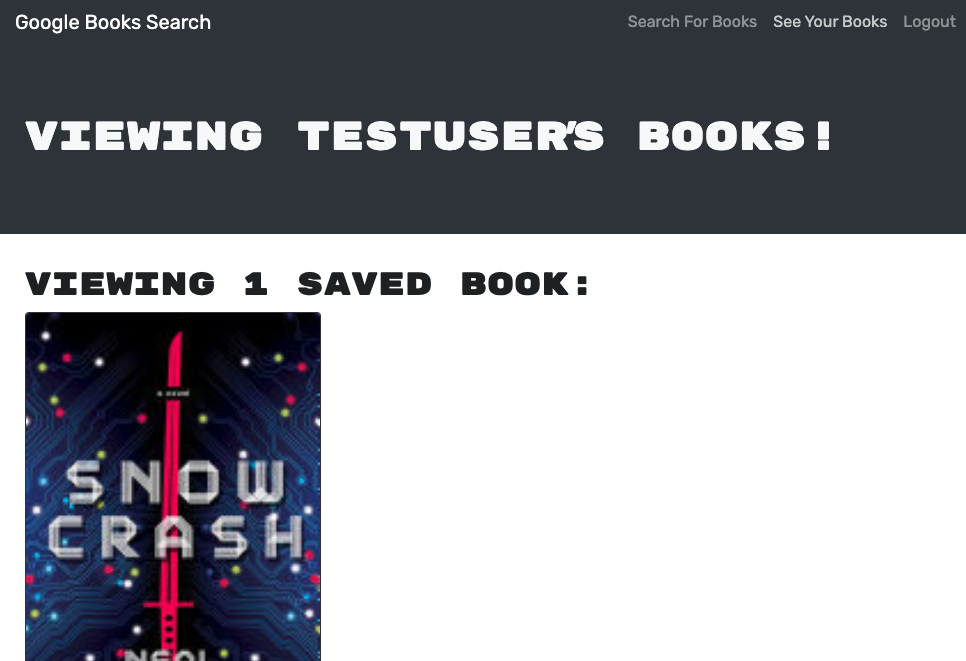

# Search_GoogleBooks_Api_21.4
Search the google books API, signup, and save favorites for later.
  

## Title: The Google Books Search & Save App
 

## Description:
This is a live deployed application to search google books library. It also allows users to create an account to save interesting titles for later. User must be logged in to save books to their account.
  

## Links:  
repo: https://github.com/xnd0/Search_GoogleBooks_Api_21.4
 
live: https://vast-headland-20181.herokuapp.com/
  

## Screenshots:

 

## Technologies Used:
React, Express, MongoDB, Node, Heroku, Javascript, CSS, JSX